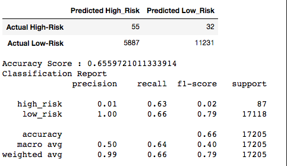
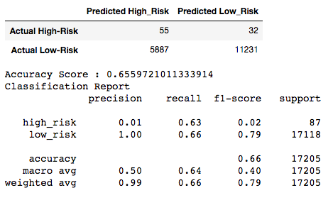
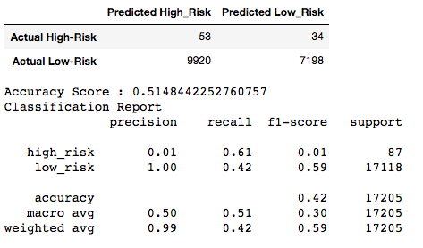
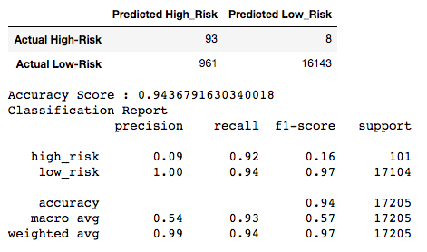
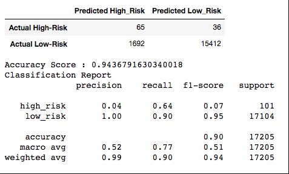

# Credit Risk Analysis

## Overview of Project
Jill commends you for all your hard work. Piece by piece, you’ve been building up your skills in data preparation, statistical reasoning, and machine learning. You are now ready to apply machine learning to solve a real-world challenge: credit card risk.

Credit risk is an inherently unbalanced classification problem, as good loans easily outnumber risky loans. Therefore, you’ll need to employ different techniques to train and evaluate models with unbalanced classes. Jill asks you to use `imbalanced-learn` and `scikit-learn` libraries to build and evaluate models using resampling.

Using the credit card credit dataset from LendingClub, a peer-to-peer lending services company, you’ll oversample the data using the `RandomOverSampler` and `SMOTE` algorithms, and undersample the data using the `ClusterCentroids` algorithm. Then, you’ll use a combinatorial approach of over and undersampling using the `SMOTEENN` algorithm. Next, you’ll compare two new machine learning models that reduce bias, `BalancedRandomForestClassifier` and `EasyEnsembleClassifier`, to predict credit risk. Once you’re done, you’ll evaluate the performance of these models and make a written recommendation on whether they should be used to predict credit risk.

## Deliverables:

1. ***Deliverable 1:*** Use Resampling Models to Predict Credit Risk
2. ***Deliverable 2:*** Use the SMOTEENN Algorithm to Predict Credit Risk
3. ***Deliverable 3:*** Use Ensemble Classifiers to Predict Credit Risk
4. ***Deliverable 4:*** A Written Report on the Credit Risk Analysis

# Deliverable 1:  
## Use Resampling Models to Predict Credit Risk 

* Create the training variables by converting the string values into numerical ones using the `get_dummies()` method.
* Create the target variables.
* Check the balance of the target variables.

Using your knowledge of the `imbalanced-learn` and `scikit-learn` libraries, you’ll evaluate three machine learning models by using resampling to determine which is better at predicting credit risk. First, you’ll use the oversampling `RandomOverSampler` and `SMOTE` algorithms, and then you’ll use the undersampling `ClusterCentroids` algorithm. Using these algorithms, you’ll resample the dataset, view the count of the target classes, train a logistic regression classifier, calculate the balanced accuracy score, generate a confusion matrix, and generate a classification report.

Follow the instructions below and use the `credit_risk_resampling_starter_code.ipynb` file to complete Deliverable 1.

Open the `credit_risk_resampling_starter_code.ipynb` file, rename it `credit_risk_resampling.ipynb`, and save it to your **Credit_Risk_Analysis** folder.

Using the information we’ve provided in the starter code, create your training and target variables by completing the following steps:

* Create the training variables by converting the string values into numerical ones using the `get_dummies()` method.
* Create the target variables.
* Check the balance of the target variables.

Next, begin resampling the training data. First, use the oversampling `RandomOverSampler` and `SMOTE` algorithms to resample the data, then use the undersampling `ClusterCentroids` algorithm to resample the data. For each resampling algorithm, do the following:

* Use the `LogisticRegression` classifier to make predictions and evaluate the model’s performance.
* Calculate the accuracy score of the model.
* Generate a confusion matrix.
* Print out the imbalanced classification report.

Save your `credit_risk_resampling.ipynb` file to your **Credit_Risk_Analysis** folder.

# Deliverable 2:  
## Use the SMOTEENN algorithm to Predict Credit Risk 

Using your knowledge of the `imbalanced-learn` and `scikit-learn` libraries, you’ll use a combinatorial approach of over and undersampling with the `SMOTEENN` algorithm to determine if the results from the combinatorial approach are better at predicting credit risk than the resampling algorithms from Deliverable 1. Using the `SMOTEENN` algorithm, you’ll resample the dataset, view the count of the target classes, train a logistic regression classifier, calculate the balanced accuracy score, generate a confusion matrix, and generate a classification report.

1. Continue using your `credit_risk_resampling.ipynb` file where you have already created your training and target variables.
2. Using the information we have provided in the starter code, resample the training data using the `SMOTEENN` algorithm.
3. After the data is resampled, use the `LogisticRegression` classifier to make predictions and evaluate the model’s performance.
4. Calculate the accuracy score of the model, generate a confusion matrix, and then print out the imbalanced classification report.

Save your `credit_risk_resampling.ipynb` file to your Credit_Risk_Analysis folder.

# Deliverable 3:  
## Use Ensemble Classifiers to Predict Credit Risk 

Using your knowledge of the `imblearn.ensemble` library, you’ll train and compare two different ensemble classifiers, `BalancedRandomForestClassifier` and `EasyEnsembleClassifier`, to predict credit risk and evaluate each model. Using both algorithms, you’ll resample the dataset, view the count of the target classes, train a logistic regression classifier, calculate the balanced accuracy score, generate a confusion matrix, and generate a classification report.

1. Open the `credit_risk_ensemble_starter_code.ipynb` file, rename it `credit_risk_ensemble.ipynb`, and save it to your **Credit_Risk_Analysis** folder.
2. Using the information we have provided in the starter code, create your training and target variables by completing the following:
    - Create the training variables by converting the string values into numerical ones using the `get_dummies()` method.
    - Create the target variables.
    - Check the balance of the target variables.
3. Resample the training data using the `BalancedRandomForestClassifier` algorithm with 100 estimators.
    - Consult the following [Random Forest documentation](https://imbalanced-learn.org/stable/references/generated/imblearn.ensemble.BalancedRandomForestClassifier.html) for an example.
4. After the data is resampled, use the `LogisticRegression` classifier to make predictions and evaluate the model’s performance.
5. Calculate the accuracy score of the model, generate a confusion matrix, and then print out the imbalanced classification report.
6. Print the feature importance sorted in descending order (from most to least important feature), along with the feature score.
7. Next, resample the training data using the `EasyEnsembleClassifier` algorithm with 100 estimators.
    - Consult the following [Easy Ensemble documentation](https://imbalanced-learn.org/stable/references/generated/imblearn.ensemble.EasyEnsembleClassifier.html) for an example.
8. After the data is resampled, use the `LogisticRegression` classifier to make predictions and evaluate the model’s performance.
9. Calculate the accuracy score of the model, generate a confusion matrix, and then print out the imbalanced classification report.

Save your `credit_risk_ensemble.ipynb` file to your **Credit_Risk_Analysis** folder.

## Results:
Below are the results from the various techniques used to predictive model for High-Risk loans.  

**SMOTEENN:**  

**SMOTE:**  

**RandomOverSample:** 

**ClusterCentroids:** 

**EasyEnsembleClassifier:** 

**BalancedRandomForestClassifier:**

## Summary

For all models, using **EasyEnsembleClassifier** was the most effective and provides a highest score for all risk loans.
The precision is low or none for all the models. In General, above the 90% of the current analysis, utlizing **EasyEnsembleClassifier** will perform a high-risk loan precision as a great value for the overall analysis. 